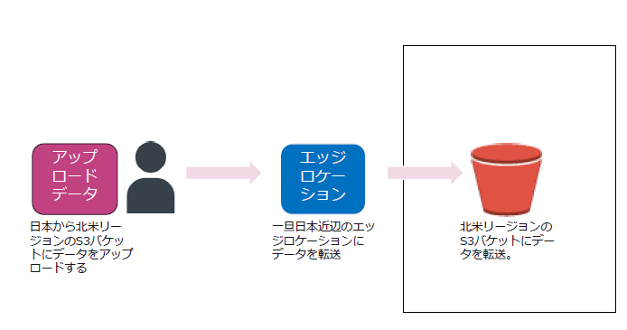

# ec2
購入方式

* リザーブドインスタンス
* オンデマンドインスタンス
* スポットインスタンス

アタッチされたebs分は課金が継続する。ec2インスタンスを停止しても料金が発生する

完全に停止するには、ec2を終了する

インスタンスタイプ

ファミリーと世代、インスタンスの容量

t2.nano

### インスタンスファミリー
汎用 : バランスが取れたコンピューティング

コンピューティング最適化 :高パフォーマンスが必要なコンピューティング

目盛り最適化 : 

ストレージ最適化 :

高速コンピューティング: 

### vCPU

CPUが利用するcpuの単位。vcpuはスレッドを実行する仮想cpuのこと
実際の処理をするスレッド数のこと

### ユーザーデータ

ec2インスタンス起動時に実行される実行スクリプトを設定できる

### ストレージ

ec2で直接利用するストレージを追加する。

1. インスタンスストア: ホストコンピューターに内蔵されたディスクでec2と不可分のブロック
レベルの物理ストレージ

    一時的にデータが保存され、ec2の停止、終了とともにデータは消える。（揮発性）

2. ebs : データ保存可能。スナップショットをs3に保存する。別途ebsの料金が必要

3. amazon efs : nasに似たファイルストレージ

## タグ設定
タグを追加して名前を付与することが出来る

## キーペアの作成
キーペアを利用して、自身がダウンロードした秘密鍵とマッチした公開鍵を有するインスタンスにアクセスする　

## 軌道テンプレート
起動テンプレートは起動の詳細内容をテンプレート化して保存することが出来る

## インスタンスの購入方式
オンデマンドインスタンス　通常の使用方法

リザーブドインスタンス: 予約方式　最大72%オフ

スポットインスタンス: 未使用のインスタンスを利用　最大90%オフ

## 物理対応可能なインスタンス
物理サーバーにインスタンスを起動して制御が可能なタイプのインスタンス

1. ハードウェア専用インスタンス
専用hwのvpcで実行されるec2インスタンス

2. dedicated host

3. bare metal

## AMI
amiはec2の設定を保存したもの。ec2を複数起動したいときなどに役立つ

# EBS
ec2インスタンスとともに利用されるブロックストレージ

awsは三つのストレージタイプを提供している

1. ブロックストレージ ebs インスタンスストアなど
2. オブジェクトストレージ　s3 など
3. ファイルストレージ EFS 複数のインスタンスから同時にアタッチ可能

特徴

ec2にアタッチされるブロックレベルのストレージサービス

* 冗長化不要。ボリュームデータはaz内で複数のハードウェアにデフォルトでレプリケートされているため

* セキュリティグループによる通信制御対象外であり、全ポートを閉じてもebsは利用可能

* データは永続的に保存可能

* 他のazのインスタンスに接続することはできない

* ebsを複数のインスタンスで共有することが出来ない

* プロビジョンドiopsは複数インスタンスで共有するマルチアタッチ機能を有する

* 同じaz内のインスタンスのみ付け替えが可能である

* スナップショットはいつでも実行可能。DLMにより取得期間を設定可能

* スナップショットはリージョン間をまたいで使用可能

* 権限を変更することで他のアカウントからもスナップショットを利用可能

* データを保持したい場合は設定変更が必要

* KMSを利用して。ｂりゅーむ作成時とスナップショット作成時に暗号化が可能

# VPCの概要
awsクラウドのネットワークの領域からユーザー専用の仮想ネットワークを構築するサービス
* 最小は/28 最大は/16
* サイズ/16のcidrブロックが割り当てられる
* デフォルトのセキュリティグループ、ACLも作成される

VPCウィザード

視覚的にネットワーク構成を一度に作成することが可能
分かりやすいUI

インターネットゲートウェイへのルーティングの有無でサブネットのタイプが決まる

ルートテーブルにインターネットゲートウェイを設定する

プレイべーとサブネット内のインスタンスがインターネットと通信するには
NATゲートウェイが必要

## よく使うgateway
* Egress-Only Internet gateway : 外部への通信を可能にするゲートウェイ。ipv6向けのインターネットゲートウェイ

* カスタマーゲートウェイ : オンプレミス環境と接続する際に利用するゲートウェイ

* 仮想プライベートゲートウェイ: VPN接続時に利用する。

## VPCとの接続
### 1 VPC→VPC外への接続

VPCエンドポイント
インターネットを介さずにVPC内からVPC外のリソースへアクセスをする機能

### VPC Peering
ふたつのVPC間でのトラフィックルーティングが可能

## 専用線接続
### ダイレクトコネクトゲートウェイ

複数リージョンにネットワークを専用線接続したい場合に利用するサービス

### VPC CloudHub
複数のサイト間VPN接続を可能にするサービス

### Direct Connect は冗長化されている
direct connect 回線自体を二重にして冗長化している

# 通信プロトコル
通信のルールが必要　IPアドレスだけだはダメ

例えば、、、

メール設定にはPOPとSMTPにIPアアドレスを設定する

POPはメール受信プロトコル
SNTPはメール受信プロトコル

## ポート番号
通信の出入り口となる部分のこと。メールボックスのような役割を担っている

## セキュリティグループとネットワークACL
### セキュリティグループ
* デフォルトではすべて拒否。

* ルールの許可のみ指定可能。インスタンス単位で指定

* インバウンドのみの指定でよい。

### ネットワークACL(デフォルト)
* デフォルトではすべて許可
* ルールの許可、拒否が指定可能　

* インバウンド・アウトバウンド両方の設定が必要

* vpc、サブネット単位で指定

### ネットワークACL(カスタム)
* デフォルトではすべて拒否

### エフェメラルポート
ネットワークaclを利用してサブネット内のリソースと通信する際は特定ポート番号に加えて、エフェメラルポートの設定が必要

* エフェメラルポートとは

# route53
ドメイン名をIPアドレスに変換するサービスのこと。ホストゾーン単位で保存する。

### ホストゾーン
ドメインとそのサブドメインのトラフィックルーティングする方法についての情報を保持するコンテナ

### エイリアスレコード
CloudFrontやELBなどのAWSリソースをドメインと関連付けるときに使うレコードのこと

# ELB
ロードバランシングサービスのこと

* IPアドレスをターゲットにした負荷分散も可能
## ELBの構成
* マルチAZにインスタンスのトラフィックを分散する。リージョンはまたげない
* プライベートサブネットとパブリックサブネットに対してELBで負荷分散させることも可能

# S3
### 利用コスト
データ量とリクエスト、データ転送に対して料金が発生する

### S3 MFA Delete
バージョニング機能のオプションとして、オブジェクト削除時にMAF認証を必須にできる

### マルチパートアップロード
大容量オブジェクトをいくつかに分けてアップロードする機能

### S3 transfer accleration
データ転送元から一番近いエッジロケーションを利用して高速にデータをアップロードするサービス

# IAM
### 管理者権限

管理者権限の許可が付与されたiamユーザーのこと
* ルートアカウントでしかできない権限は付与されない

### パワーユーザー
IAM以外のすべてのawsサービスに古アクセス権限を有するiamユーザー

IAMの捜査権限はない。

## AWS organizations
複数のAWSアカウントを統合管理できるサービスのこと

出来ること
* 複数アカウントの一元管理
* 新規アカウント作成管理
* 一括請求(複数アカウントの請求を一括化する)

# AWS cloudtrail
マネジメントコンソールやAPIを通した操作の記録を取っている

sshなどのリモートアクセス記録は残せない